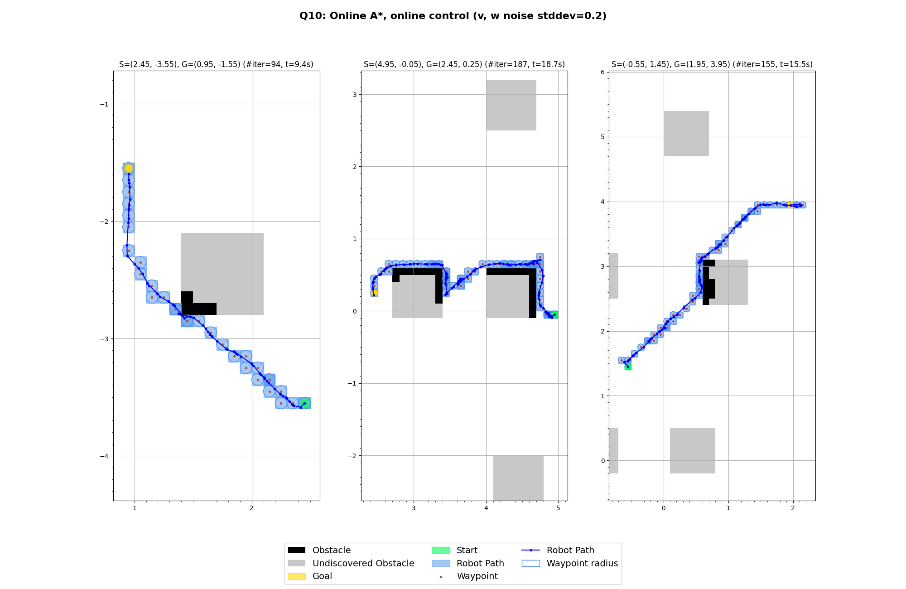

# A* Navigation for a Differential Drive Robot

**Author:** Conor Hayes  
Written for CS/ME469: Machine Learning and Artificial Intelligence for Robotics, Northwestern University ([Prof. Brenna Argall](https://www.argallab.northwestern.edu/people/brenna/))

---

## Overview
This repo implements A* path planning with a low-level waypoint controller for a simulated differential-drive robot, applied to a real-world obstacle map from the [UTIAS Multi-Robot Cooperative Localization and Mapping Dataset](http://asrl.utias.utoronto.ca/datasets/mrclam/index.html).

All code is implemented in Python using only numerical + plotting libraries (NumPy, Pandas, Matplotlib, Seaborn) — no higher-level robotics or planning libraries allowed.

A full writeup including derivations, algorithm descriptions, and discussion of results is available in [writeup.pdf](writeup.pdf).

The system plans and executes robot navigation by combining:
- **Offline A\*** path planning on a fully-known obstacle grid, using an admissible Euclidean-distance heuristic normalized by the cell diagonal length
- **Online A\*** path planning with incremental obstacle discovery (robot observes obstacles only when adjacent to them)
- **Obstacle inflation** by 0.3m in all directions for safer path clearance
- A **dual P-controller** that drives the robot toward waypoints with configurable gains, biases, and acceleration limits
- A **robot navigation simulator** (`RobotNavSim`) that propagates control outputs through the motion model with Gaussian noise


*Fig 10 — Online A\* with simultaneous closed-loop waypoint control across three start/goal pairs (cell size = 0.1m, u noise stddev = 20% max). The robot path (blue) is replanned at each step as new obstacles are discovered (grey = undiscovered).*

---

## Install

```bash
uv sync
```

Requires Python 3.13+.

Alternatively, with pip:

```bash
pip install -r requirements.txt
```

---

## Run

```bash
uv run run.py
```

This outputs all plots from the writeup (Questions 3, 5, 7, 8, 9, 10, 11). Close each plot window to advance to the next.

To save all figures to the `figures/` directory instead of displaying interactively:

```bash
uv run run.py --save
```

---

## Data

Place the dataset files in `data/ds1/`:

```
data/ds1/
  ds1_Barcodes.dat
  ds1_Control.dat
  ds1_Groundtruth.dat
  ds1_Landmark_Groundtruth.dat
  ds1_Measurement.dat
```

Files are available on the [UTIAS Multi-Robot Cooperative Localization and Mapping Dataset](http://asrl.utias.utoronto.ca/datasets/mrclam/index.html) site, under MRCLAM_Dataset9, Robot3.

---

## Repo Contents

| File | Description |
|------|-------------|
| `run.py` | Entry point; calls one function per question |
| `hw1/astar.py` | Offline A* with admissible diagonal-normalized heuristic |
| `hw1/online_astar.py` | Online A* with incremental obstacle discovery |
| `hw1/map.py` | Grid map with obstacle inflation and world↔grid coordinate transforms |
| `hw1/motion_control.py` | Dual P-controller (`WaypointController`) and robot nav simulator (`RobotNavSim`) |
| `hw1/motion_model.py` | Differential-drive motion model (reused from HW0) |
| `hw1/plot.py` | All plotting functions |
| `hw1/data.py` | Dataset loading utilities |
| `hw1/utils.py` | Grid kernel writing and other helpers |

---

## Key Results

- **Offline A\*** finds optimal paths given full map knowledge; online A\* adapts in real time as obstacles are revealed, sometimes taking detours when obstacles block the initially planned route.
- **Obstacle inflation** by 0.3m is essential for safe execution — without it, the controller clips into obstacle boundaries under noise.
- The **dual P-controller** navigates all test paths successfully at low-to-moderate noise levels. A waypoint acceptance radius of ~½ cell size keeps motion smooth and prevents loopback behavior near waypoints.
- **Coarse grids** (1×1m) yield smoother, faster trajectories due to fewer waypoints and wider turns; **fine grids** (0.1×0.1m) yield shorter path distances but require tighter maneuvering, which stresses the controller.
- **Simultaneous planning and driving** (Q10/Q11) handles control noise more gracefully than post-hoc control (Q9), since deviations automatically trigger replanning rather than requiring the robot to double back.

## Acknowledgements
- Thanks to [Prof. Brenna Argall](https://www.argallab.northwestern.edu/people/brenna/) for providing the assignment for her course *Machine Learning and Artificial Intelligence for Robotics* (CS/ME469) at Northwestern University.
- Thanks to the UTIAS Multi-Robot Cooperative Localization and Mapping Dataset team for providing the curated dataset.
- A* pseudocode reference: [Wikipedia — A* search algorithm](https://en.wikipedia.org/wiki/A*_search_algorithm)